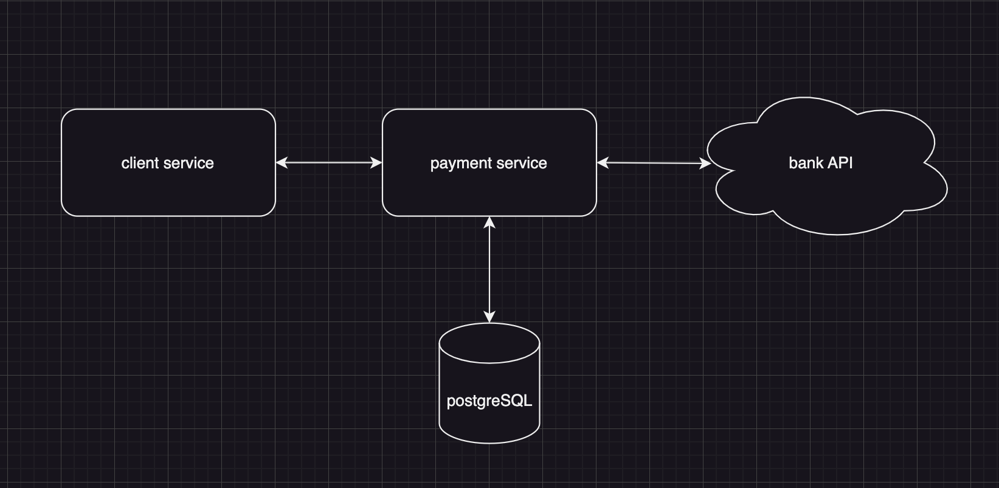

# Information about the payment system

I have designed the microservices interaction, and there are three services:
- gateway-service is an entry point into applications;
- payment-service is the main service where I wrote the main handlers and logic;
- bank-api is an imitation of an external banking service with which we communicate using the REST API. You can check this out on the scheme at the very bottom.

What I already did:
1. user creation handler `v1/user/create`
2. user logging handler `v1/user/login`
3. user deletion handler `v1/user/delete/{uuid}`
4. user fetching handler `v1/user/fetch/{uuid}`
5. start all databases and all servers using only one command
6. migrations

What I am planning to do:
1. cover the code with unit tests and e2e tests
2. implement a GET request to bank-api and get payment information in case of a network break or any other problems during interaction between microservices
3. implement a worker that will send an update of payment information to gateway-service in case of a network break or any other problems during interaction between microservices
4. implement a worker that will transfer data from actual payment information to all payment information

In the `project` repository can be found all files with basic commands and the main `docker-compose.yml`

To start all services in Docker, you need to clone this repository to your local computer:
```
git clone git@github.com:GermanLepin/payment_service.git
```

Go to `project`
```
cd project/
```

Let's start all services and databases with the command:
```
make up_build
```

// TODO Swagger
# payment system API

type User struct {
	ID           uuid.UUID
	FirstName    string
	LastName     string
	Password     string
	Email        string
	Phone        int
	UserType     string
	JWTToken     string
	RefreshToken string
}


Implemented a creation method. Accepts a user name, a user last name, a user phone number, a user email, and a user password.

| Key              | Data type | Description         | Example
|------------------|-----------|---------------------|--------------------- |
| first_name       | string    | a user first name   | John                 |
| last_name        | string    | a user last name    | Smith                |
| password         | string    | a user password     | 1234qwer             |
| email            | string    | a user email        | john@gmail.com       |
| phone            | int       | a user phone number | 4912345678901        |
| user_type        | string    | a user type         | admin/user           |


POST method.

    http://localhost:9000/v1/user/create


*Add to the request body (JSON format):*
```
{
	"first_name":"Jonn",
	"last_name": "Smith",
	"password":"1234qwer",
	"email":"john@gmail.com",
	"phone": 4912345678901,
	"user_type":"user"
}
```


Implemented a payment method. Accepts the user ID, bank card information, and amount to pay. 

| Key              | Data type | Description                                     | Example
|------------------|-----------|-------------------------------------------------|----------- |
| user id          | uuid      | a positive unique user identifier               | 6864c1e7-11b8-4380-ab2a-3021e83621d4 |
| amount           | float32   | a positive amount of debit from the account     | 999.99     |
| card_number      | uint32    | a card number                                   | 1111222233334444   |
| card_holder_name | string    | a card holder name                              | NAME NAME  |
| cvv              | uint32    | a cvv of the card                               | 123        |

POST method.

    http://localhost:9000/v1/payment/transaction

*Add to the request body (JSON format):*
```
  {
    "user_id": "6864c1e7-11b8-4380-ab2a-3021e83621d4",
	"amount": 999.99,
	"card_number": 1111222233334444,
	"card_holder_name": "NAME NAME",
	"cvv": 123
  }
```

*Request response (JSON format):*
```
  {
	"operation_id": "bee7a44c-5176-4e42-ae26-02f306390473",
	"user_id": "6864c1e7-11b8-4380-ab2a-3021e83621d4",
	"status": "succeed",
	"error": ""
  }
```

In case of an error, information about the user and a description of the error will also be received

*Request response (JSON format):*
```
{
	"operation_id": "8649ed3d-4128-4299-bbd0-4cf9d098a0ae",
	"user_id": "6864c1e7-11b8-4380-ab2a-3021e83621d4",
	"status": "error",
	"error": "client: error making http request: Post \"http://bank-api/payment\": dial tcp: lookup bank-api on 127.0.0.0:53: no such host"
}
```

# The scheme of the payment system

